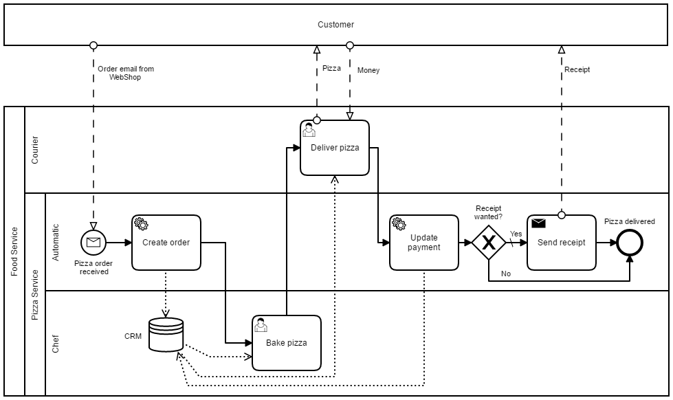
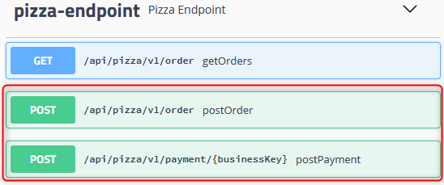
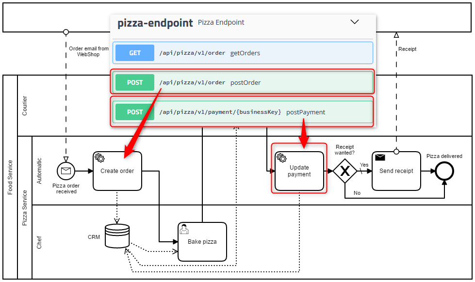
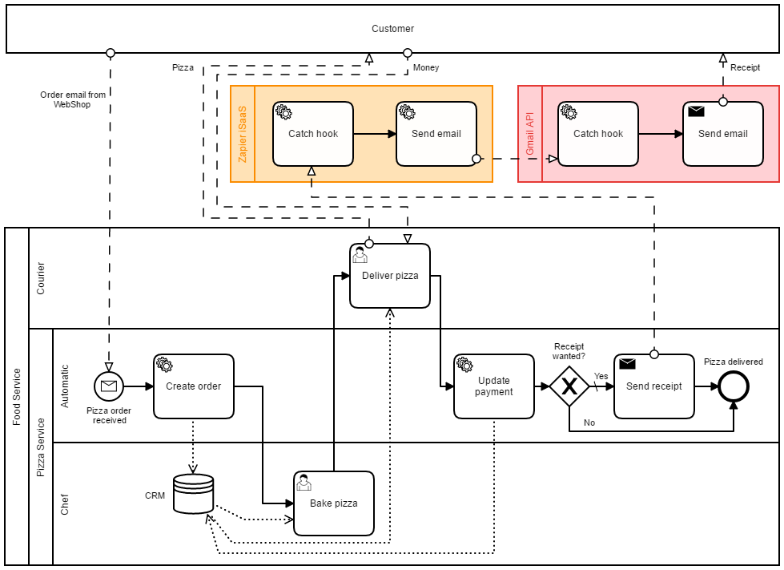

# BPM Service Integration Example

[](https//www.apache.org/licenses/LICENSE-2.0.html)
[](https://heroku.com/deploy)

This example illustrates how service integration can be realized with Camunda and the help of Postman without touching Java.

> This service integration guide is a follow-up of the [BPM Workflow Example]()https://github.com/fhnw-bpm/bpm-workflow-example and is relying on the [BPM API Example](https://github.com/fhnw-bpm/bpm-api-example).

#### Contents:
- [1. BPM Service Integration Example Project](#1-bpm-service-integration-example-project)
- [2. Booting Environment](#2-booting-environment)
- [3. Integration Engineering](#3-integration-engineering)
    - [Step 1: Import Camunda Environment](#step-1--import-camunda-environment)
    - [Step 2: Pre-request Scripts](#step-2--pre-request-scripts)
- [4. Service Integration](#4-service-integration)
    - [Step 1: HTTP Connector and Template](#step-1--http-connector-and-template)
    - [Step 2: Input Parameter](#step-2--input-parameter)
    - [Step 3: Deployment](#step-3--deployment)
- [5. iSaaS Service Integration](#5-isaas-service-integration)
- [References / Links](#references---links)
- [Maintainer](#maintainer)
- [License](#license)

## 1. BPM Service Integration Example Project

Download this repository and extract the files - similar as shown here:


> Please note that the animation is showing a different repository.

This repository is a copy of the [digibp-camunda-template repository on GitHub](https://github.com/DigiBP/digibp-camunda-template) and is based on the following structure:


## 2. Booting Environment

Run your implementation of the [BPM API Example](https://github.com/fhnw-bpm/bpm-api-example) on port `8081`.

Then compile and run this workflow microservice project on the default port `8080`.

Finally, open the `pizza-service-technical-service-integration.bpmn` file stored under `src\main\resources\modelling` of this project:



## 3. Integration Engineering

In engineering, especially in software development, software testing is a fundamental principle. Developers are writing tests before they start with their actual implementation to specify what the application has to fulfil - this is referred to unit testing<sup name="ref2r">[2](#ref2)</sup>.

It is therefore not surprising that testing is not excluded as well when using APIs<sup name="ref3r">[3](#ref3)</sup> and integrating services. Consequently, it is recommended to write API tests prior doing a service integration into a BPMN workflow too.

### Step 1: Import Camunda Environment

As mentioned above testing is an essential part of engineering. And when testing, you are trying the replicate the reality within a testing environment. Therefore DigiBP provides you with a Postman environment reproducing the Camunda engine and the Camunda HTTP connector extension. You can import that Postman environment and a collection as a blueprint by clicking on the following button:

[](https://app.getpostman.com/run-collection/37f50747a36dd0054d89#?env%5BCamunda%5D=W3siZW5hYmxlZCI6dHJ1ZSwia2V5IjoiY2FtdW5kYSIsInZhbHVlIjoidmFyIGV4ZWN1dGlvbj1uZXcgY2xhc3N7Y29uc3RydWN0b3IoKXt0aGlzLmRhdGE9bmV3IE1hcH1nZXRQcm9jZXNzSW5zdGFuY2VJZCgpe3JldHVybiBudWxsPT10aGlzLnByb2Nlc3NJbnN0YW5jZUlkJiYodGhpcy5wcm9jZXNzSW5zdGFuY2VJZD1NYXRoLmZsb29yKDY1NTM2KigxK01hdGgucmFuZG9tKCkpKSksdGhpcy5wcm9jZXNzSW5zdGFuY2VJZH1zZXRQcm9jZXNzSW5zdGFuY2VJZChiKXtudWxsPT10aGlzLnByb2Nlc3NJbnN0YW5jZUlkP3RoaXMucHJvY2Vzc0luc3RhbmNlSWQ9Yjpjb25zb2xlLmVycm9yKFwiSW5pdCBwcm9jZXNzIGluc3RhbmNlIGlkIG9ubHkgb25jZVwiKX1nZXRCdXNpbmVzc0tleSgpe3JldHVybiBudWxsPT10aGlzLnByb2Nlc3NCdXNpbmVzc0tleSYmKHRoaXMucHJvY2Vzc0J1c2luZXNzS2V5PU1hdGguZmxvb3IoNjU1MzYqKDErTWF0aC5yYW5kb20oKSkpKSx0aGlzLnByb2Nlc3NCdXNpbmVzc0tleX1zZXRCdXNpbmVzc0tleShiKXtudWxsPT10aGlzLnByb2Nlc3NCdXNpbmVzc0tleT90aGlzLnByb2Nlc3NCdXNpbmVzc0tleT1iOmNvbnNvbGUuZXJyb3IoXCJJbml0IHByb2Nlc3MgYnVzaW5lc3Mga2V5IG9ubHkgb25jZVwiKX19LHBheWxvYWQ9bmV3IGNsYXNze3NldChiKXt0aGlzLmJvZHk9YixwbS52YXJpYWJsZXMuc2V0KFwicGF5bG9hZFwiLGIpfX07aWYocG0ucmVzcG9uc2Upe3RyeXt2YXIgcmVzcG9uc2U9SlNPTi5zdHJpbmdpZnkocG0ucmVzcG9uc2UuanNvbigpKX1jYXRjaChhKXt2YXIgcmVzcG9uc2U9SlNPTi5zdHJpbmdpZnkoXCJpbnZhbGlkIGpzb25cIil9dmFyIHN0YXR1c0NvZGU9cG0ucmVzcG9uc2UuY29kZX0iLCJ0eXBlIjoidGV4dCJ9XQ==)

> This feature enables you to write test with an environment which makes you feel as you would write directly within Camunda. 

> And yes for the techies, `eval` is evil, but it is currently the only way to integrate predefined JavaScript code into Postman.

For the following both endpoint paths you will find in the imported collection a request template in Postman, where you should write a pre-request script each:



### Step 2: Pre-request Scripts

> Please note that this step is an iterative task for both service tasks in the BPMN model.

In the pre-request script tab, you are going to write the script for the Camunda input parameters. In Postman the resulting data of the script is going to be placed into the body of the request. 

Switch to the body tab and set the following postman variable (if you imported the blueprint collection above, it is already there: `{{payload}}`.

Now it is time that you write your pre-request script by using this template:
```JavaScript
// Connector-START • Camunda HTTP Connector JavaScript emulation:
eval(pm.environment.get("camunda"));
// Connector-END

// Test-Data-START • Initialise process variables, and (optionally) business key and/or process id:

pizzaType = "";
/* further process variables here */
execution.setBusinessKey("case-001");

// Test-Data-END

// Service-Task-Input-START • Camunda HTTP Connector Input Parameter payload Script:
out = JSON.stringify({
  "businessKey": execution.getBusinessKey(),
  /* further JSON data here */
  "pizzaType": pizzaType
});
// Service-Task-Input-END

// Body-START • Postman Body {{payload}}:
payload.set(out);
// Body-END 
```

First emulating the Camunda environment including the process variables and workflow data by defining them between `// Test-Data-START` and `// Test-Data-END`.

> Keep in mind to **name your process variables** the same way as defined in tor process model.

Then you are going to write they actual part, which will be embedded into the BPMN model. You are going to produce the payload containing the workflow data serialised as a JSON object by defining it between `// Service-Task-Input-START` and `// Service-Task-Input-END`.

If you did everything as instructed, you should receive a `201 Created` after pressing the `Send` button in Postman.

## 4. Service Integration

Finally, integrate your services into your process model as described in the subsequent steps and shown in the following animation:

[](https://digibp.github.io/images/wiki/2018-04-05_21h34.gif)

> Please note that the animation is showing a different process.

### Step 1: HTTP Connector and Template

Define (or change) the service task implementation by using the `2. Service Task REST with Body` template. 

This template pre-defines to `Camunda HTTP Connector`<sup name="ref4r">[4](#ref4)</sup>, which can be inspected by switching to the `Connector` tab.

> However the `Camunda HTTP Connector`<sup name="ref4r">[4](#ref4)</sup> can also be configured manually without using a template.

### Step 2: Input Parameter

Copy the Postman pre-request script part between `// Service-Task-Input-START` and `// Service-Task-Input-END` and paste it to the `Script` field of the `Camunda HTTP Connector` input parameter `payload`.

Do that for every service task:



### Step 3: Deployment

Now you are ready to deploy your process and test if it works as expected.

## 5. iSaaS Service Integration

Please use the following link to a Zapier iSaaS integration of the Gmail API to send an electronic receipt: https://hooks.zapier.com/hooks/catch/2050261/fzoaaq/

> Please note that the Zap is switched of to avoid email spam.

To implement the `send receipt` message task as shown as follows, please use the `send receipt` request of the imported Postman collection.



The implementation can be realised in a similar way as instructed in the [4. Service Integration](#4-service-integration) section above.

## References / Links

<sup name="ref1">[1](#ref1r)</sup> _Element Templates_ 
- https://docs.camunda.org/manual/latest/modeler/camunda-modeler/element-templates 
- https://github.com/camunda/camunda-modeler/tree/master/docs/element-templates

<sup name="ref2">[2](#ref2r)</sup> _Unit testing_
- https://en.wikipedia.org/wiki/Unit_testing

<sup name="ref3">[3](#ref3r)</sup> _API Debugging and Testing_ 
- https://www.getpostman.com/tools#debug
- https://blog.getpostman.com/2014/03/07/writing-automated-tests-for-apis-using-postman

<sup name="ref4">[4](#ref4r)</sup> _Camunda HTTP Connector_ 
- https://docs.camunda.org/manual/latest/reference/connect/http-connector
- DigiBP Example: https://github.com/DigiBP/digibp-camunda-examples/tree/master/service-task
- Camunda Example: https://github.com/camunda/camunda-bpm-examples/tree/master/servicetask/rest-service

## Maintainer
- [Andreas Martin](https://github.com/andreasmartin)
- [Digitalisation of Business Processes](https://github.com/digibp)

## License

- [Apache License, Version 2.0](https://github.com/DigiBP/digibp-archetype-camunda-boot/blob/master/LICENSE)